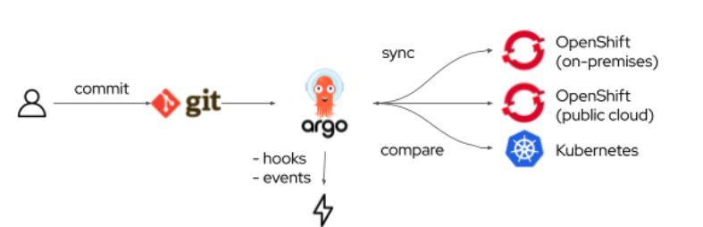

# Introduction to GitOps using ArgoCD with OpenShift GitOps Demo

Welcome to the Introduction to ArgoCD using OpenShift GitOps demo!

Application definitions, configurations and environments should be declarative and version controlled just as we been doing with applications code. Application deployment and lifecycle management should be `automated`, `auditable` and `easy to understand`. Hence the need for a framework such as [`GitOps`](#gitops) and tools like [`ArgoCD`](#argocd) and [`OpenShift GitOps`](#openshift-gitops)

## ArgoCD
[ArgoCD](https://argo-cd.readthedocs.io/en/stable/) is a declarative, `GitOps` continuous delivery tool for [Kubernetes](https://kubernetes.io/). 

It follows the `GitOps` pattern of using [Git](Githttps://git-scm.com) repositories as the sources of truth for defining the desired application state.

It automates the deployment of the desired application states in the specified taget environments. It can track updates to branches, tags or even pinned to a specifc version of a manifests at a Git commits. In other words, any changes to the desired state made in git can be automatically or manually applied & reflected in the specific environment.

The manifest can be specified using any of the following ways:
* [`Kustomize`](https://kustomize.io/)
* helm
* ksonnets
* jsonnets
* pain directory of YAML/json manifest
* other

## GitOps
[GitOps](https://cloud.redhat.com/learn/topics/gitops/) is a set of practices that leverage Git workflows to manage infrastructure and application configurations. By using Git repository as the single source of truth, it allows `DevOps` teams to store the entire state of the cluster configuration in a Git repository so that the trail of changes are visible and auditable.

It simplify the propagation of infrastructure and application configuration changes across multiple clusters by defining your infrastructure and applicaitons definition as `code`.
* Ensure that the cluster have similar states for configurations, monitoring or storage
* Resover or recreate cluster from a known state
* Create cluster with a known state
* Apply or revert configuration changes to multiple clusters
* Associate templated configuration with different environments.

## OpenShift GitOps

OpenShift GitOps is an OpenShift add-on which provides Argo CD and other tooling to enable teams to implement Gitops workflows for cluster configuration and application delivery. 



## Overview
The tutorial is divide in different section:
* [Learn about ArgoCD features](#features)
* [Learn about ArgoCD concepts](#concepts)
* [Install GitOps Operator](install-openshift-gitops)
* [Deploy an application](#deploy-application)

### Prerequisites

* Any Openshift cluster 4.x or CodeReady Container base on OCP 4.3+
* OpenShift CLI `oc` install and connected to your cluster
* The [ArgoCd CLI](https://argo-cd.readthedocs.io/en/stable/cli_installation/) 'argocd` install
* The [Tekton CLI](https://github.com/tektoncd/cli) `tkn` install
* [Kustomize](https://kustomize.io/)

### Features 
* Automated deploymnet of app to a specified target environment
* Multiple config management or tooling supports
* Ability to manafe & deploy to multiple cluster
* SSO Integrations
* Multi-tenancy and RBAC integration
* `Automated configuration drift` detection ad visualisation
* Automated or manual sync to desired state
* Web UI for real-time view of activity
* CLI for aumomation and Countinuous Integration (CI)
* Audit trails and Prometheus metrics 
* Webhooks


### Concepts:
* `Application`: A group of Kubernetes resources. It represente a Custom Resource Definition (CRD).
* ` Application Source Type`: The tools use to build the applicaiton.
* `Target state`: The desired state as represented in a Git repository
* `Live state`: The live state of the application.
* `Sync status`: Wheter ot not the Target state or Live state matches.
* `Sync`: The process of making an applicaiton move to it target state.
* ` Sync operation status`: Wether the sync succeeded or not.
* `xRefresh`: Comare the latest code in Git with the live state. Figure out what is different.
* `Health`: The health of the application.
* `Tool`: A tool to create the manifest.

#### [Application Set](https://argocd-applicationset.readthedocs.io/en/stable/)
ApplicationSet controller is a sub-project of ArgoCD which adds Application automation. Application may be templated from multiple different sources, including Git or ArgoCD own define cluster. It gives the ability to use a single manifest to target multiple cluster. It also permits a single manifest to deploy multiple application from 1+ git repository. There is 3 types of generators:
* List Generator
* Cluster Generator
* Git Generator  

#### Sync Phase and Waves

`ArgoCD` executes synch operation in a number of steps. At a high level there is 3 phases:
1. `Pre-sync` phase
1. `Sync` phase
1. `Post-Sync` phase

Each phase can contain one or more `waves` assuring certain resources are healthy before other resources are sync.


### Install OpenShift GitOps
The operator can be installed using the Operator Hub inside the OpenShift Console. Follow [these instruction](/docs/install-gitops-operator.md) to install the operator using the console. 

username: admin
password: need to be retrieve from secret

Retrive the required information with the command line:

#### Retrive the cluster argoCD route
```
oc get route openshift-gitops-server -n openshift-gitops -o jsonpath='{.spec.host}{"\n"}'
```

#### Retrieve the password.
```
oc extract secret/openshift-gitops-cluster -n openshift-gitops --to=-
```


### Deploy Application

#### Retrive the development argoCD route
```
 oc get route coffeeshop-argocd-server -n coffeeshop-gitops -o jsonpath='{.spec.host}{"\n"}'
 ```

#### Retrieve the password.
```
oc extract secret/argocd-cluster -n coffeeshop-gitops --to=-
```

